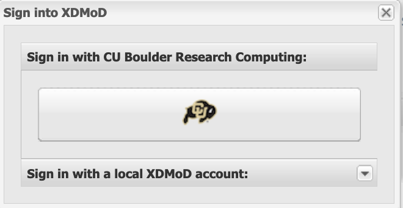

## Tutorial: Getting the most out of CU Research Computing resources

### Objectives: 

_To better understand how to access information on:_

* your high-performance computing resource consumption on Alpine, Summit and Blanca
* average wait times in the CURC queues and your relative "priority"
* the efficiency of your research workflows

---

### Methods:

_We will explore two groupings of tools:_


1. __Command-line__: the "slurmtools" module

  * How many Service Units ("SUs") have I used recently? 
  * Who is using all of the SUs on my group's account?
  * What jobs have I run over the past few days?
  * What is my priority?  
  * How efficient are my jobs? 
 
2. __Web-based__: https://xdmod.rc.colorado.edu

  * How long are queue waits right now?
  * How many SUs have I used over the past month? 

---

### Tutorials:

#### Command line tools: the `slurmtools` module

__Step 1__: If you have a CURC account, login as you normally would using your identikey and Duo from a terminal: 

```bash
ssh ralphie@login.rc.colorado.edu
```
or, if you _do not_ have a CURC account, ask the instructor for a temporary username and password and login as follows:

```bash
ssh user00<NN>@tlogin1.rc.colorado.edu
```

__Note__: _Don't have a terminal application on your computer? No problem!  You can login to CURC via our browser-based portal, [CURC Open OnDemand](https://ondemand.rc.colorado.edu)!  Once logged in, choose the "Clusters" option and open a terminal shell for the resource you want to use (Alpine, Summit, or Blanca).  [Addtional Documentation](https://curc.readthedocs.io/en/latest/gateways/OnDemand.html)_

__Step 2__: Load the slurm module for either Alpine, Summit, or Blanca (whichever HPC resource you want to query metrics about):

```bash
module load slurm/alpine
```
or
```bash
module load slurm/summit
```
or
```bash
module load slurm/blanca
```

__Step 3__: Load the `slurmtools` module:

```bash
module load slurmtools
```

...you'll see the following informational message:

```
You have sucessfully loaded slurmtools, a collection of functions
 to assess recent usage statistics. Available commands include:

 'suacct' (SU usage for each user of a specified account over N days)

 'suuser' (SU usage for a specfied user over N days)

 'seff' (CPU and RAM efficiency for a specified job)

 'jobstats' (job statistics for all jobs run by a specified user over N days)

 'levelfs' (current fair share priority for a specified user)


 Type any command without arguments for usage instructions
 ```

__Step 4__: Let's get some metrics!

___How many Service Units (core hours) have I used?___

Type the command name for usage hint:
```bash
suuser
```
```
Purpose: This function computes the number of Service Units (SUs)
consumed by a specified user over N days.

Usage: suuser [userid] [days, default 30]
Hint: suuser ralphie 15
```

Check my usage for the last 180 days:
```bash
suuser monaghaa 180
```
```
SU used by user monaghaa in the last 180 days:
Cluster|Account|Login|Proper Name|Used|Energy|
alpine|admin|monaghaa|Andrew Monaghan|15987|0|
alpine|ucb-general|monaghaa|Andrew Monaghan|5403|0|
```

This output tells me that:
* I've used "SUs" across four different accounts over the past year
* My usage by account varied from 3,812 SUs to 15,987 SUs

---

___Who is using all of the SUs on my groups' account?___

Type the command name for usage hint:
```bash
suacct
```
```
Purpose: This function computes the number of Service Units (SUs)
consumed by each user of a specified account over N days.

Usage: suacct [account_name] [days, default 30]
Hint: suacct ucb-general 15
```

Check `admin` account usage over past 180 days:
```bash
suacct admin 90
```
```
SU used by account (allocation) admin in the last 90 days:
Cluster|Account|Login|Proper Name|Used|Energy
alpine|admin|||731256|0
alpine| admin|crea5307|Craig Earley|12|0
alpine| admin|monaghaa|Andrew Monaghan|978|0
alpine| admin|rcops|User|3|0
```

This output tells me that:
* Three users used the account in the past 90 days.
* Their usage ranged from 3 SUs to 978 SUs

---

___What jobs have I run over the past few days?___

Type the command name for usage hint:
```bash
jobstats
```
```
Purpose: This function shows statistics for each job
run by a specified user over N days.

Usage: jobstats [userid] [days, default 5]
Hint: jobstats ralphie 15
```

Check my jobstats for the past 6 days:
```bash
jobstats monaghaa 6
```
```bash
job stats for user monaghaa over past 6 days
jobid        jobname  partition    qos          account      cpus state    start-date-time     elapsed    wait
-------------------------------------------------------------------------------------------------------------------
8359         sinterac amilan-ucb   normal       admin        2    CANCELLE 2022-04-05T09:54:14 00:00:00   0 hrs
8367         sinterac amilan-ucb   normal       admin        2    CANCELLE 2022-04-05T10:35:36 00:00:00   0 hrs
8369         sinterac amilan-ucb   normal       admin        2    CANCELLE 2022-04-05T10:35:53 00:00:00   0 hrs
8370         sinterac amilan-ucb   normal       admin        2    CANCELLE 2022-04-05T10:36:00 00:56:08   0 hrs
8372         run_subm amilan-ucb   normal       admin        64   COMPLETE 2022-04-05T10:41:19 00:15:19   0 hrs
8377         sinterac aa100-ucb    normal       admin        64   CANCELLE 2022-04-05T11:32:50 02:44:50   0 hrs
8409         sinterac amilan-ucb   normal       admin        1    TIMEOUT  2022-04-05T16:20:36 01:00:04   0 hrs
```

This output tells me that:
* I've run 7 jobs in the past 6 days
* All jobs had queue waits of < 1 hour
* The number of cores requested ranged from 1-->64
* The elapsed times ranged from 0 hours to 2 hours and 44 minutes

---

___What is my priority?___

Type the command name for usage hint:
```bash
levelfs
```
```
Purpose: This function shows the current fair share priority of a specified user.
A value of 1 indicates average priority compared to other users in an account.
A value of < 1 indicates lower than average priority
	(longer than average queue waits)
A value of > 1 indicates higher than average priority
	(shorter than average queue waits)

Usage: levelfs [userid]
Hint: levelfs ralphie
```

Check my fair share priority:
```bash
levelfs monaghaa
```
```
monaghaa
admin LevelFS: inf
ucb-general LevelFS: 44.796111
tutorial1 LevelFS: inf
ucb-testing LevelFS: inf
```

This output tells me:
* I haven't used `admin`, `tutorial1`, or `ucb-testing` for more than a month, and therefore I have very high ("infinite") priority. 
* I have used `ucb-general` but not much. My priority is >> `, therefore I can expect lower-than-average queue waits compare to average ucb-general waits.


___NOTE___

What is "Priority"?  

* Your priority is a number between 0.0 --> 1.0 that defines your relative placement in the queue of scheduled jobs
* Your priority is computed each time a job is scheduled and reflects the following factors:
	* Your "Fair Share priority" (the ratio of resources you are allocated versus those you have consumed for a given account)
	* Your job size (slightly larger jobs have higher priority)
	* Your time spent in the queue (jobs gain priority the longer they wait)
	* The partition and qos you choose (this is a minor consideration on CURC systems)
* Your "Fair Share" priority has a half life of 14 days (i.e., it recovers fully in ~1 month with zero usage)
* _Note: Fair share priority does not apply to Blanca_

---

___How efficient are my jobs?___

Type the command name for usage hint:
```bash
seff
```
```
Usage: seff [Options] <Jobid>
       Options:
       -h    Help menu
       -v    Version
       -d    Debug mode: display raw Slurm data
```

Now check the efficiency of job 8636572:
```bash
seff 8372
```
```
Job ID: 8372
Cluster: alpine
User/Group: monaghaa/monaghaapgrp
State: COMPLETED (exit code 0)
Nodes: 1
Cores per node: 64
CPU Utilized: 00:15:03
CPU Efficiency: 1.54% of 16:20:16 core-walltime
Job Wall-clock time: 00:15:19
Memory Utilized: 4.12 GB
Memory Efficiency: 1.72% of 239.38 GB
```

This output tells me that:
* the 64 cores reserved for this job were 1.54% utilized (anything > 80% is pretty good), so this example suggests we should analyze our workflow and make some tweaks. 
* 4.12 GB RAM was used of 239.38 GB RAM reserved (1.72%). Most jobs (though not this one!) are "cpu bound" so the memory inefficiency is not a major issue.


#### Web-based tools: https://xdmod.rc.colorado.edu


All CURC users have access to XDMoD (CU Boulder, CSU and RMACC). At this time, login is only supported for CU Boulder users.  Non-CU Boulder users may still query all of the statistics available to CU Boulder users, they just won't have the ability to personalize metrics. 

##### Step 1: Navigate to the CURC XDMoD instance

In your browser navigate to https://xdmod.rc.colorado.edu. Upon reaching there you will see a summary screen similar to the following image.


This screen provides some "quick stats" and summary plots that address some of the most common user questions, such as average wait times and recent resource usage by system (Summit or Blanca) and partition.  These metrics may be all you need. If you want to personalize metrics you can login with your CURC username and password (currently supported for CU Boulder users only).

##### Step 2: Login (CU Boulder users only)

Choose the __Sign In__ option near the upper left of the screen.  This will initiate a pop-up window that gives you the option to _"Sign in with CU Boulder Research Computing"_ or _"Sign in with a local XDMoD account"_. 



Choose the option for _"Sign in with CU Boulder Research Computing"_ and enter your CURC username and password. The portal uses 2-factor authentication, so you will need to accept the Duo push to your phone to complete login.

##### Step 3: Familiarize yourself with XDMoD

Whether or not you login, you'll start on the _"Summary"_ screen.  


The following tabs will be available, depending on whether you are logged in
* __Summary__ (the screen you are on when you login)
* __Usage__ (provides access to an expansive set of resource-wide metrics)
* __Metrics Explorer**__ (similar to the _Usage_ tab, but with additional functionality)
* __Data Export**__ (enables raw data to be output in _csv_ or _json_ format for use in other apps)
* __Report Generator**__ (facilitates the creation of reports that can be saved and shared)
* __Job Viewer**__ (enables users to search for and view jobs that meet specified criteria)
* __About__ (provide general information on the XDMoD software)

_** - only available to users who are logged in._

_Notes on XDMoD Syntax_
* a "CPU Hour" is a "core hour" (e.g., for a single job, this would be the number of `ntasks` a user specifies in their job script multipled by how long the job runs)
* a "PI" is a project account (e.g., `ucb-general`)

##### Step 4: Become a pro!

XDMoD can query a seemingly endless number of metrics, more than could ever be described in this documentation.  To learn how to query specific metrics, customize your views, etc., please refer to the XDMoD documentation:

https://xdmod.rc.colorado.edu/user_manual/index.php

___NOTE___: You can also obtain special roles such as "PI" in XDMoD that will give you more fined-grained access to statistics. If this is of interest, please email rc-help@colorado.edu to request. 


##### Example use case

Let's say you want to see how many core hours you project account has used over time, including the usage by user.  

* Go to the _Usage_ tab.
* In the "Metrics and Options" menu, choose _CPU Hours: Total_ to create a graph of total CPU hours consumed over a default period. In XDMoD syntax a "CPU Hour" refers to a "core hour" (for a single job, this would be the number of `ntasks` a user chooses in their job script multipled by how long the job runs).  
* Click anywhere on the blue line in the graph to expose the "Drill Down" menu:


* Choose the "Resource" option.  This will break out the CPU hours by Alpine, Summit and Blanca. 


* Now choose the "PI" option.  In XDMoD syntax a "PI" is a project account (e.g., `ucb-general`).  
* This will revise the graph to show CPU usage for different "PIs" (accounts), showing only the accounts with the greatest usage. Your account may not be shown. To find it click the _Filter_ tab at the top and search for your project (e.g., `ucb-general`). 
* You will now see a graph showing only core hours used by your account. 


* To see core hours used for each user of the account, click anywhere on the line to expose the "Drill Down" menu and choose the _User_ option.
* This will revise the graph to show CPU usage by user.  If you don't see your user of interest, you can use the _Filter_ tab at the top to find them.
* You can change the time range of the x-axis by specifying the dates in the "Start" and "End" boxes near the top of the screen.

---

### Final items:

* Questions?  Email rc-help@colorado.edu

* Please consider providing feedback on this tutorial via this brief survey: http://tinyurl.com/curc-survey18

* Links
  * [CURC XdMOD documentation](https://curc.readthedocs.io/en/latest/gateways/xdmod.html)
  * [XdMOD user manual](https://xdmod.rc.colorado.edu/user_manual/index.php) 

* Acknowledgements
  * Alpine is jointly funded by the University of Colorado Boulder, the University of Colorado Anschutz, Colorado State University, and the National Science Foundation.
  * Blanca is jointly funded by computing users and the University of Colorado Boulder.
  * XDMoD is funded under NSF grant numbers ACI 1025159 and ACI 1445806.
