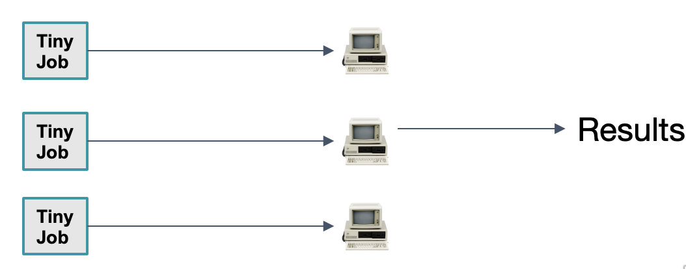
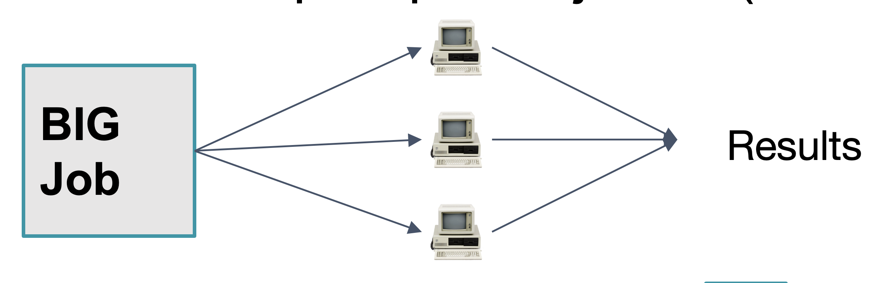
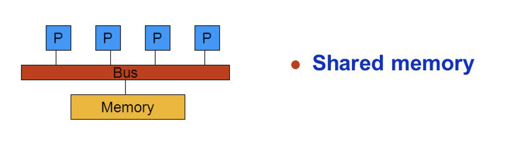
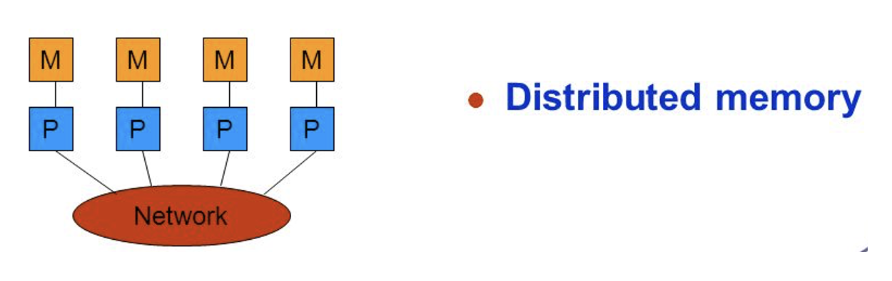
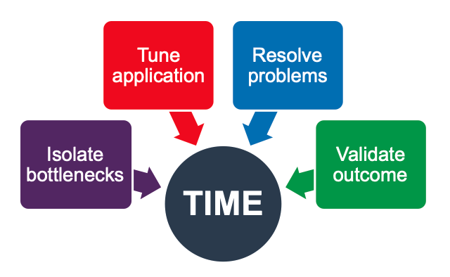
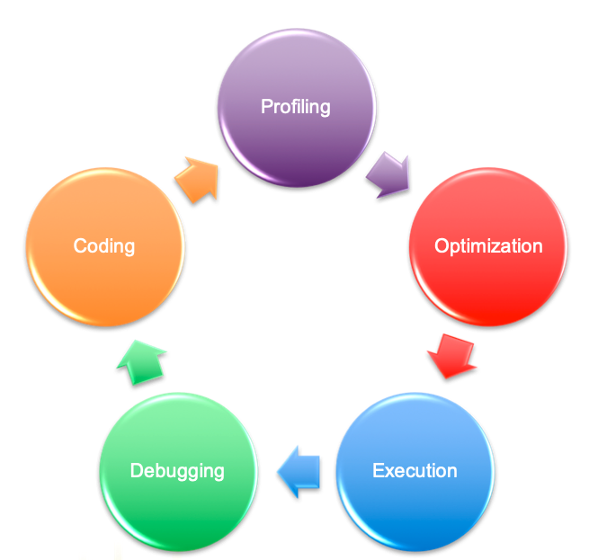
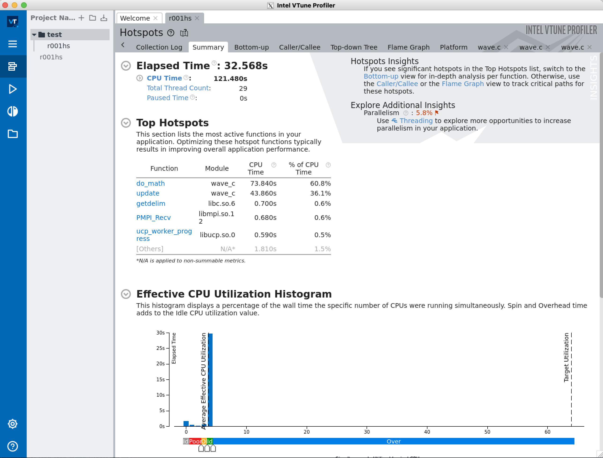
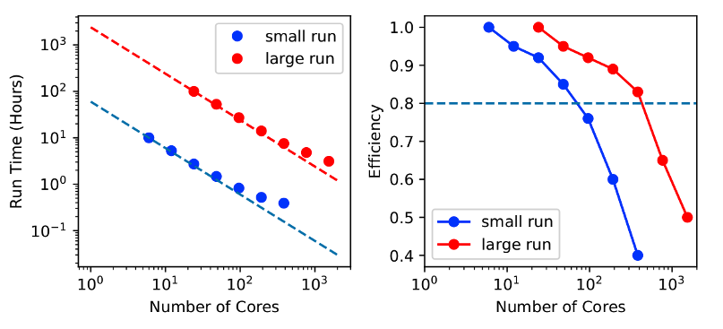
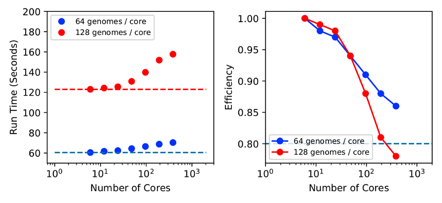

# Tutorial: Maximizing efficiency using parallelization, with an introduction to profiling and scaling

## Objectives: 

_To gain an understanding of:_

* Basic parallelization concepts
* How parallelization is implemented on Alpine
* How to invoke parallelization on Alpine
* What code __profiling__ is and how to get started
* What code __scaling__ is and how to get started

---
## Parallelization

Sometimes problems become too large to solve in a reasonable amount of time using a single computing processor.  Fortunately, many types of problems can be decomposed into smaller pieces that can be solved simultaneously by distributing them across many processors. Examples include processing thousands of images from an electron microscope, or using a model to predict the weather at millions of points across North America. 

### External Parallelization

In this scenario, the user has lots of similar serial (single-core) tasks they need to accomplish. Rather than refine the code itself, the user runs lots of simultaneious iterations of the code, taking advantage of the many processors available on high performance computers. This method is sometimes called "load balancing".



_Examples:_
* Monte Carlo simulations
* Image processing

_Pros:_ 
* Incredibly easy
* Scales very well

_Cons:_ 
* Requires a bit more hands-on approach to keep track of 100s-to-1000s of jobs
* Only works for tasks that are independent of each other

_Tools for load balancing on Alpine_
* [CURC Load Balancer](https://curc.readthedocs.io/en/latest/software/loadbalancer.html)
* [Gnu Parallel](https://curc.readthedocs.io/en/latest/software/GNUParallel.html)

### Internal Parallelization

In this scenario, the user implements the parallelizaton from within the code, perhaps because the tasks are dependent on one another and need to communicate with each other (pass messages) during simulations. This method requires modifying the code itself. 



_Examples:_
* Climate models
* Molecular dynamics simulations

_Pros:_ 
* Enables effecient solutions for complex, interdependent systems
* Simpler to manage jobs (one job does lots of tasks)
* Many software packages that do internal parallelization are already available

_Cons:_ 
* Unique problems may not have software available, requiring you to parallelize the code yourself
* Most internally-parallelized jobs do not scale linearly due to message passing overhead


__Now let's login for some hands-on exercises__

_For CU Boulder and CSU users:_

Login as you normally would using your identikey (CU) or EID (CSU):

```bash
ssh ralphie@login.rc.colorado.edu #CU
...or
ssh cam@colostate.edu@login.rc.colorado.edu #CSU
```
...and then accept the Duo push to your phone to complete login.

_For CU Anschutz and RMACC users:_

* Navigate to https://ondemand-rmacc.rc.colorado.edu
* Choose the `ACCESS CI (XSEDE)` Identity Provider
* Login with your ACCESS or XSEDE username and password
* Accept the Duo push to your phone to complete login
* Select the `Clusters` tab at the top and choose `>Alpine Shell`

Now, once logged into a CURC terminal, start a job as follows: 

Start a 4 core interactive job across 2 Alpine nodes (assumes you are already logged in)
```bash
module load slurm/alpine
sinteractive --nodes=2 --nasks-per-node=2 --partition=amilan --reservation=sc_parallel --time=1:00:00
```

Now let's download the exercises
```bash
cd /scratch/alpine/$USER
git clone https://github.com/ResearchComputing/Summer_Camp_2023
```

#### Internal Parallelization type 1: Shared memory parallelization

Parallelization that is done on a single node (computer), such that the processes can all share a common memory (RAM).  Shared memory parallelization is often referred to as "OpenMP" or "multithreading".



Software designed specifically for shared memory parallelization often will automatically parallelize when the user runs the software executable, if the machine has multiple cores. Lets use the OpenMP program `openmp_hello.cpp` in the _parallel_examples_ subdirectory to explore more: 

```bash
cd /scratch/alpine/$USER/Summer_Camp_2023/Day_Three/parallel/parallel_examples/
ls
```

Now
```bash
module load gcc/11.2.0
g++ openmp_hello.cpp -o openmp_hello.exe -fopenmp
```

...now run the code: 
```bash
export OMP_NUM_THREADS=1
./openmp_hello.exe
```

What happened? Now try again, this time with 4 threads: 
```bash
export OMP_NUM_THREADS=4
./openmp_hello.exe
```
What was the result? 

#### Internal Parallelization type 2: Distributed memory parallelization

Parallelization that is done on a multiple nodes (computers), such that the processes cannot all share a common memory (RAM). Therfore they must pass information over high speed networks that connect the nodes. Distributed memory parallelization is often called "MPI" (message passing interface).



Software designed for distributed memory parallelization usually must be invoked at the command line by preceeding the software executable name with `mpirun`. Lets use the MPI program `mpi_hello.cpp` in the _parallel_examples_ subdirectory to explore more: 

```bash
cd /scratch/alpine/$USER/Summer_Camp_2023/Day_Three/parallel/parallel_examples/
ls
```

```bash
module load gcc/11.2.0
module load openmpi/4.1.1
mpic++ mpi_hello.cpp -o mpi_hello.exe
```

...now run the code: 
```bash
mpirun ./mpi_hello.exe
```

What happened? Now try again, this time specifying the number of threads: 
```bash
mpirun -n 2 ./openmp_hello.exe
```
What was the result? 


 
## Profiling

### _Profiling is measuring the performance of your code_


#### _Goal_: identify issues and rectify them so that code runs faster:


 
###### Source: Allinea


#### Profiling is part of the coding cycle:




###### Source: Allinea

### Incredibly Simple Profiling

Time the program externally with the Linux `time` function (_Example code can be found in `simple_examples` subdirectory_): 

```
module load python
time python external_timing.py
```


* _Pros:_ fast, easy
* _Cons:_ Doesn't provide information about where or why bottlenecks occur
* Use cases 
  * when you already know where a bottleneck is within the code. 
  * code is relatively simple (e.g., a single-file script)

### Simple profiling 

Add timing wrappers around subsections of code (internal) (_Example code can be found in `simple_examples` subdirectory_): 

```
module load python
time python internal_timing.py
```

let's inspect the code...it uses the ___python___ `time` package and some simple calls. 


* _Pros:_ also relatively fast, easy. Helps isolate where bottlenecks occur.
* _Cons:_ Doesn't provide information about why bottlenecks occur
* Use cases: 
  * when you do not know where bottleneck is
  * code is relatively simple 

### Software-based profiling

* Vendor-based software. CURC has:
  * [Intel VTune](https://www.intel.com/content/www/us/en/develop/documentation/vtune-help/top.html) (basic profiling), [Advisor](https://www.intel.com/content/www/us/en/develop/documentation/get-started-with-advisor/top.html) (vectorization/threading), [Trace Analyzer](https://www.intel.com/content/www/us/en/develop/documentation/get-started-with-itac/top.html) (MPI)
  * [Arm-Forge](https://developer.arm.com/Tools%20and%20Software/Arm%20Forge) (formerly Allinea)
* Community-based software that you can download for free, install on your own
  * [GNU Profile](https://ftp.gnu.org/old-gnu/Manuals/gprof-2.9.1/html_mono/gprof.html) (`gprof`)
  * [AMD uprof](https://developer.amd.com/amd-uprof)
  * [HPC Toolkit](http://hpctoolkit.org)
  * Lots of others: [Oprofile](https://oprofile.sourceforge.io/news/), [perf](https://perf.wiki.kernel.org/index.php/Tutorial#Introduction) [TAU](https://www.cs.uoregon.edu/research/tau/home.php), [Scalasca](https://www.scalasca.org)

#### Example

Let's use _Vtune_ to profile an mpi program written in ___c___ called `wave.c`. You'll find all of the files you need in this repository.

Step 1: Login

__Note:__ For this exercise yuou will need an X11 client on your laptop/desktop computer in order to forward graphics from Alpine back to your local machine. 
 * Mac: [Xquartz](https://www.xquartz.org)
 * Windows: [PuTTY](https://www.putty.org)

_For CU Boulder and CSU users:_

Login as you using your identikey (CU) or EID (CSU), adding an `-X` to the `ssh` command:

```bash
ssh -X ralphie@login.rc.colorado.edu #CU
...or
ssh -X cam@colostate.edu@login.rc.colorado.edu #CSU
```
...and then accept the Duo push to your phone to complete login.

_For CU Anschutz and RMACC users:_

* _X11 login option coming soon!_

Step 2: Start an interactive job with 4 cores. 

```
module load slurm/alpine
sinteractive -N 1 -n 4 -t 60 --reservation=sc_parallel
```

Step 3: Load the modules you need:

```
module load intel impi vtune
```

Step 4: In the directory where you downloaded `wave.c`, compile it with `make`:

```
make
```

Step 5: If successful, this will result in the executable `wave_c`. Run vtune on the executable:

```
vtune -collect hotspot mpirun -n 4 ./wave_c
```

_this will take about 1 minute and will create a directory called something like r000hs that contains results_

Step 6: Now view the output to identify bottlenecks (requires X11-forwarding)

```
vtune-gui r000hs
```

_which will produce an interactive screen that looks like this:_
 


Now, with Vtune graphical user interface (gui), you can find areas of the code that took the longest to run. If you identify bottlenecks, you would then iteratively work to improve them (not covered in this tutorial). 

---

## Scaling
 
### _Scaling is the trial-and-error process of running multiple iterations of a parallel application, with each iteration using a different number of threads (cores), and then comparing the results to determine how the _efficiency_ of the code changes with the number of threads._ 
 
#### Efficiency

##### `Efficiency = Expected Time /  Actual Time` where: 
* _Expected_ ("ideal") time is often taken relative to application’s serial performance, or performance at a low core count.
* _Actual_ time is the result of your scaling run.

##### In the real world, parallel processes are not 100% efficient due to:
* communications overhead
  * “fabric” latency 
  * processes waiting on each other 
* limitations of problem size
* limitations of what parts of the code can be parallelized (Amdahl’s law)

_Therefore, the efficiency will typically decrease as the number of threads increases._
 
##### The "Optimal" efficiency for a particular workflow depends on the context
   * If you have an operational application, say a weather forecast that needs to be produced in a specific timeframe, you'll want to find the optimal efficiency that enables the job to be completed in time for the product deadline.  You may be satisfied to run with a relatively low efficiency as long as the job is done in time. 
   * If you have a research application, whereby you aren't constrained by near-term deadlines, then you typically will strive to achieve the maximum efficiency possible. This will almost always mean running with the *fewest* cores possible while remaining under the wall clock limits on HPC (24 hours typically, on our system)
 
__Rule of thumb:__ >=80% efficiency is pretty good. 
 
##### Types of Scaling

___Strong___

Keep the problem size constant and keep increasing the number of threads (cores).

 

___Weak___

Increase both the problem size and the number of threads (cores) in a consistent manner (e.g., double the problem size if you double the cores).

  


---

### Final items:

* Questions?  Email rc-help@colorado.edu

* Please consider providing feedback on this tutorial via this brief survey: http://tinyurl.com/curc-survey18

* Links to resources that informed this presentation
  * [Intel Vtune docs](https://www.intel.com/content/www/us/en/docs/vtune-profiler/user-guide/2023-0)
  * [SDSC profiling tutorial](https://education.sdsc.edu/training/interactive/hpc_user_training_2021/week7/) 
  * [U. Utah CHPC profiling slides](https://www.chpc.utah.edu/presentations/images-and-pdfs/Profiling20.pdf)
  * [Arm-Forge/Allinea profiling and debugging slides](https://www.alcf.anl.gov/files/Allinea.pdf)

* Acknowledgements
  * Alpine is jointly funded by the University of Colorado Boulder, the University of Colorado Anschutz, Colorado State University, and the National Science Foundation.
  * Blanca is jointly funded by computing users and the University of Colorado Boulder.
  * XDMoD is funded under NSF grant numbers ACI 1025159 and ACI 1445806.
